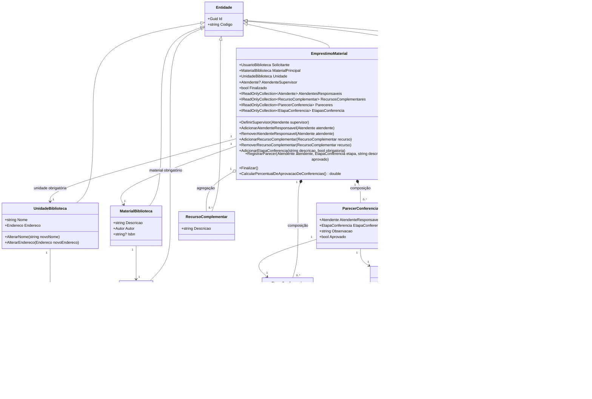

# Sistema de Empréstimos de Biblioteca

Projeto desenvolvido em C# para modelar parte de um sistema de empréstimos de materiais em uma biblioteca física e digital integrada.

O foco do projeto é demonstrar uma modelagem orientada a objetos consistente, com associações obrigatórias e opcionais, agregação, composição, encapsulamento de coleções, validações de domínio e proteção de invariantes.

---

## Sumário

- [1. Objetivo do projeto](#1-objetivo-do-projeto)
- [2. Tecnologias utilizadas](#2-tecnologias-utilizadas)
- [3. Organização do projeto](#3-organização-do-projeto)
  - [3.1 Estrutura de pastas](#31-estrutura-de-pastas)
  - [3.2 Namespaces](#32-namespaces)
- [4. Modelagem do domínio](#4-modelagem-do-domínio)
  - [4.1 Entidades](#41-entidades)
  - [4.2 Objetos de valor](#42-objetos-de-valor)
  - [4.3 Objetos de composição do empréstimo](#43-objetos-de-composição-do-empréstimo)
- [5. Diagrama de classes](#5-diagrama-de-classes)
- [6. Regras de negócio](#6-regras-de-negócio)
  - [6.1 Regras gerais de criação e alteração](#61-regras-gerais-de-criação-e-alteração)
  - [6.2 Regras dos atendentes](#62-regras-dos-atendentes)
  - [6.3 Regras dos recursos complementares](#63-regras-dos-recursos-complementares)
  - [6.4 Regras das etapas de conferência](#64-regras-das-etapas-de-conferência)
  - [6.5 Regras dos pareceres](#65-regras-dos-pareceres)
  - [6.6 Regras de finalização](#66-regras-de-finalização)
  - [6.7 Regra de cálculo do percentual de aprovação](#67-regra-de-cálculo-do-percentual-de-aprovação)
- [7. Decisões arquiteturais](#7-decisões-arquiteturais)
  - [7.1 Uso de entidades](#71-uso-de-entidades)
  - [7.2 Uso de record](#72-uso-de-record)
  - [7.3 Uso de Guid e código textual](#73-uso-de-guid-e-código-textual)
  - [7.4 Encapsulamento das coleções](#74-encapsulamento-das-coleções)
  - [7.5 Agregação e composição](#75-agregação-e-composição)
- [8. Demonstração no Program.cs](#8-demonstração-no-programcs)
- [9. Como executar](#9-como-executar)
- [10. Uso de Inteligência Artificial](#10-uso-de-inteligência-artificial)
- [11. Possíveis melhorias](#11-possíveis-melhorias)
- [12. Autores](#12-autores)

---

## 1. Objetivo do projeto

O sistema representa o processo de empréstimo de um material acadêmico para um usuário da biblioteca.

Um empréstimo possui:

- usuário solicitante;
- material principal;
- unidade da biblioteca;
- supervisor opcional;
- atendentes responsáveis;
- recursos complementares;
- etapas de conferência;
- pareceres registrados durante o processo.

A implementação não utiliza banco de dados, interface gráfica ou frameworks externos. A intenção é concentrar a solução na qualidade da modelagem orientada a objetos.

---

## 2. Tecnologias utilizadas

- C#
- .NET 8
- Programação Orientada a Objetos
- Mermaid para documentação do diagrama de classes

---

## 3. Organização do projeto

### 3.1 Estrutura de pastas

```text
Biblioteca-App/
├── Domain/
│   ├── Conference/
│   │   ├── EtapaConferencia.cs
│   │   └── ParecerConferencia.cs
│   │
│   ├── Entities/
│   │   ├── Atendente.cs
│   │   ├── Autor.cs
│   │   ├── EmprestimoMaterial.cs
│   │   ├── Entidade.cs
│   │   ├── MaterialBiblioteca.cs
│   │   ├── RecursoComplementar.cs
│   │   ├── UnidadeBiblioteca.cs
│   │   └── UsuarioBiblioteca.cs
│   │
│   └── ValueObjects/
│       └── Endereco.cs
│
├── Infrastructure/
│   └── Validation/
│       └── RegularExpressions.cs
│
├── Program.cs
├── Biblioteca-App.csproj
├── README.md
└── .gitignore
```

### 3.2 Namespaces

O projeto foi organizado em namespaces para separar responsabilidades:

| Namespace | Responsabilidade |
|---|---|
| `BibliotecaApp.Domain.Entities` | Entidades principais do domínio, como usuário, atendente, material e empréstimo. |
| `BibliotecaApp.Domain.ValueObjects` | Objetos de valor, como endereço. |
| `BibliotecaApp.Domain.Conference` | Objetos relacionados à conferência do empréstimo. |
| `BibliotecaApp.Infrastructure.Validation` | Recursos técnicos auxiliares de validação, como expressões regulares. |

Essa divisão evita concentrar todas as classes em uma única pasta genérica e melhora a legibilidade do projeto.

---

## 4. Modelagem do domínio

### 4.1 Entidades

Entidades são objetos com identidade própria no sistema. Mesmo que seus dados sejam semelhantes, duas entidades podem representar objetos diferentes.

Foram modeladas como entidades:

- `UsuarioBiblioteca`
- `Atendente`
- `Autor`
- `MaterialBiblioteca`
- `UnidadeBiblioteca`
- `RecursoComplementar`
- `EmprestimoMaterial`

Todas herdam de `Entidade`, que fornece:

- `Guid Id`: identificador técnico único;
- `string Codigo`: código textual amigável derivado do `Guid`.

Exemplos de códigos gerados:

```text
USR-8F14E45F
MAT-A91BC22D
EMP-55AA10CC
```

### 4.2 Objetos de valor

Objetos de valor são definidos pelos próprios dados, e não por identidade.

O projeto usa `Endereco` como objeto de valor. Ele foi modelado como `record`, pois dois endereços com os mesmos campos podem ser considerados equivalentes.

### 4.3 Objetos de composição do empréstimo

As classes `EtapaConferencia` e `ParecerConferencia` pertencem ao processo de empréstimo.

Por isso, seus construtores foram definidos como `internal`, reforçando que, em uso externo ao projeto, esses objetos devem ser criados por meio dos métodos de `EmprestimoMaterial`:

- `AdicionarEtapaConferencia(...)`
- `RegistrarParecer(...)`

---

## 5. Diagrama de classes



---

## 6. Regras de negócio

### 6.1 Regras gerais de criação e alteração

1. Campos textuais obrigatórios não podem ser nulos, vazios ou conter apenas espaços.
2. E-mails são opcionais, mas devem ter formato válido quando informados.
3. CEPs devem seguir o formato `00000-000`.
4. ISBNs são opcionais, mas devem ser válidos quando informados.
5. Objetos obrigatórios recebidos por construtor ou método não podem ser nulos.
6. Objetos inválidos não devem ser criados nem alterados para estados inconsistentes.

### 6.2 Regras dos atendentes

1. Um empréstimo pode ter um supervisor opcional.
2. O supervisor deve ser um objeto real do tipo `Atendente`.
3. O empréstimo pode ter vários atendentes responsáveis.
4. Atendentes responsáveis não podem ser nulos.
5. Atendentes responsáveis não podem ser duplicados no mesmo empréstimo.
6. O supervisor não pode ser adicionado também como atendente responsável.
7. Atendentes responsáveis não podem ser adicionados ou removidos após a finalização do empréstimo.
8. A remoção de atendente responsável só é permitida se ele estiver associado ao empréstimo.

### 6.3 Regras dos recursos complementares

1. Recursos complementares são agregados ao empréstimo.
2. Um recurso complementar deve ser criado fora do empréstimo.
3. Recursos complementares não podem ser nulos.
4. Recursos complementares não podem ser duplicados no mesmo empréstimo.
5. Recursos complementares não podem ser adicionados ou removidos após a finalização.
6. A remoção de recurso complementar só é permitida se ele estiver associado ao empréstimo.

### 6.4 Regras das etapas de conferência

1. Etapas de conferência pertencem ao empréstimo.
2. Etapas devem ser criadas pelo próprio `EmprestimoMaterial`.
3. A descrição da etapa é obrigatória.
4. Não podem existir duas etapas com a mesma descrição no mesmo empréstimo.
5. Etapas não podem ser adicionadas após a finalização.
6. O empréstimo precisa possuir pelo menos uma etapa obrigatória para ser finalizado.

### 6.5 Regras dos pareceres

1. Pareceres pertencem ao empréstimo.
2. Um parecer deve estar associado a um atendente responsável.
3. Um parecer deve estar associado a uma etapa pertencente ao empréstimo.
4. A descrição do parecer é obrigatória.
5. O mesmo atendente não pode registrar dois pareceres para a mesma etapa.
6. Pareceres não podem ser registrados após a finalização do empréstimo.

### 6.6 Regras de finalização

1. O empréstimo só pode ser finalizado uma vez.
2. O empréstimo deve possuir pelo menos um atendente responsável.
3. O empréstimo deve possuir pelo menos uma etapa obrigatória.
4. Todas as etapas obrigatórias devem ter parecer registrado.
5. O supervisor, se existir, não pode estar também na lista de atendentes responsáveis.
6. Após finalizado, o empréstimo não aceita novos atendentes, recursos, etapas ou pareceres.

### 6.7 Regra de cálculo do percentual de aprovação

1. O percentual de conferências aprovadas só pode ser consultado após a finalização.
2. O cálculo considera quantas etapas possuem pelo menos um parecer aprovado.
3. O percentual é calculado pela razão entre etapas aprovadas e total de etapas cadastradas.

---

## 7. Decisões arquiteturais

### 7.1 Uso de entidades

Classes como `UsuarioBiblioteca`, `Atendente`, `Autor`, `MaterialBiblioteca`, `UnidadeBiblioteca`, `RecursoComplementar` e `EmprestimoMaterial` foram modeladas como entidades porque possuem identidade própria no sistema.

### 7.2 Uso de record

`Endereco` e `ParecerConferencia` foram modelados como `record`.

- `Endereco` é um objeto de valor.
- `ParecerConferencia` representa um registro imutável de avaliação.

### 7.3 Uso de Guid e código textual

Cada entidade possui um `Guid` como identificador técnico e um `Codigo` textual amigável.

Pontos positivos:

1. Garante unicidade com alta segurança prática.
2. Não depende de banco de dados para gerar IDs.
3. Permite diferenciar entidades com dados semelhantes.
4. Facilita exibição de códigos mais amigáveis do que o `Guid` completo.

Pontos negativos:

1. O código textual derivado do `Guid` não é sequencial.
2. Pode ser exagerado para sistemas muito pequenos.
3. Em bancos relacionais, `Guid` aleatório pode impactar índices se usado diretamente como chave primária.
4. Códigos aleatórios são menos fáceis de memorizar do que códigos sequenciais.

### 7.4 Encapsulamento das coleções

As coleções internas de `EmprestimoMaterial` foram declaradas como:

```csharp
private readonly List<T>
```

E expostas como:

```csharp
IReadOnlyCollection<T>
```

Isso impede que código externo modifique diretamente as listas internas e force a alteração do estado por métodos de negócio.

### 7.5 Agregação e composição

`RecursoComplementar` foi modelado por agregação, pois existe independentemente do empréstimo.

`EtapaConferencia` e `ParecerConferencia` foram modelados por composição, pois pertencem ao empréstimo e são controlados por ele.

---

## 8. Demonstração no Program.cs

O arquivo `Program.cs` demonstra:

1. Criação de usuário, autor, material, unidade, atendentes e recursos complementares.
2. Criação de um empréstimo válido.
3. Definição opcional de supervisor.
4. Adição de atendente responsável.
5. Adição de recursos complementares.
6. Adição de etapas de conferência.
7. Registro de pareceres.
8. Tentativas inválidas tratadas com `try/catch`.
9. Finalização do empréstimo.
10. Exibição do percentual de conferências aprovadas.

Exemplos de tentativas inválidas demonstradas:

1. Adicionar atendente responsável duplicado.
2. Adicionar supervisor como responsável.
3. Adicionar recurso complementar duplicado.
4. Remover recurso não associado.
5. Registrar parecer com atendente não responsável.
6. Registrar parecer para etapa que não pertence ao empréstimo.
7. Calcular percentual antes da finalização.
8. Finalizar empréstimo sem parecer em todas as etapas obrigatórias.
9. Adicionar etapa depois da finalização.
10. Criar usuário com nome vazio.

---

## 9. Como executar

### 9.1 Pré-requisito

- .NET SDK 8.0 ou superior.

O projeto foi preparado para:

```xml
<TargetFramework>net8.0</TargetFramework>
```

### 9.2 Executar pelo terminal

Na pasta do projeto, execute:

```bash
dotnet build
dotnet run
```

---

## 10. Uso de Inteligência Artificial

Durante o desenvolvimento deste projeto, ferramentas de Inteligência Artificial foram utilizadas como apoio técnico e educacional em atividades como:

1. Revisão de modelagem orientada a objetos.
2. Discussão sobre encapsulamento, agregação e composição.
3. Refinamento de validações e invariantes.
4. Sugestões de melhorias arquiteturais.
5. Revisão textual e organização do README.
6. Apoio na estruturação do fluxo de demonstração em `Program.cs`.

As decisões finais de modelagem, implementação e estruturação do sistema foram analisadas, adaptadas e validadas manualmente pelo autor do projeto.

---

## 11. Possíveis melhorias

1. Criar testes automatizados com xUnit ou NUnit.
2. Criar camada de persistência em banco de dados.
3. Criar interface de linha de comando para entrada dinâmica de dados.
4. Separar regras mais complexas em serviços de domínio, se o projeto crescer.
5. Implementar histórico de alterações do empréstimo.

---

## 12. Autor

- Moises Grassi
